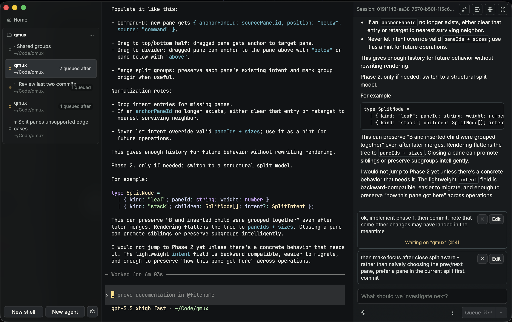

# qmux

qmux is a desktop app for running terminals and coding agents
side-by-side, with vertical tabs and a Cursor-like sidebar for
transcript rendering.

<p align="center"></p>

It has a native UI for launching agents, queueing follow-ups,
tracking agent status, and driving TUI-based agents.

Agents are integrated through a pluggable adapter layer. Claude Code,
Codex, OpenCode, and Grok are included as adapters, each with lifecycle
hooks, native transcripts, session resumes, and native forks. New agents
can be added by implementing the adapter trait in Rust and adding a
matching UI adapter on the frontend.

## Features

- Native Ghostty terminals: each pane hosts a Metal-rendered Ghostty
  surface on macOS, with a portable Rust PTY backend for tests and
  non-macOS platforms.
- Agent panes for Claude Code, Codex, OpenCode, and Grok, launched from the app
  or by running `claude` / `codex` / `opencode` / `grok` inside a shell pane.
- Transcript JSONL tailing and a native follow-up composer: send, queue,
  steer, edit/reorder queued turns, and approve/deny permission prompts where
  supported.
- qMux slash commands in the follow-up composer: `/fork <message>` branches the
  current session, while `/worktree <message>` branches it in a fresh worktree.
  Typing `/` opens an upward command typeahead.
- Session/transcript recovery. Respawns recoverable panes and agents on
  restart, along with drafts that you've typed in qmux.
- Persisted pane, group, agent, transcript, and queued-turn metadata with
  best-effort restart recovery.
- Session forking from inside a running agent session (`qmux fork`),
  supported natively by all four adapters.
- Saved prompt library: prompts as Markdown files with global and
  per-project scopes, `{placeholder}` fill-in, and a `Cmd-K` command
  palette covering prompts, tab navigation, and pane actions.
- App settings: color themes, body font, terminal font and size,
  terminal theme (qmux default plus bundled Ghostty color schemes), mouse
  wheel sensitivity, and a macOS wake lock that keeps the machine awake
  while agents are running (skipped on battery below 10%).
- (Experimental) git worktree creation for launched agents, with configurable
  global, local `.qmux/`, or local `.claude/` storage, dirty-worktree checks,
  and a delete-or-keep prompt when closing worktree-backed panes.
- (Experimental) A tab-bound, resizable browser that renders a local file or a
  `http://localhost` dev server in a panel over the terminal. Markdown
  files render as styled HTML.
- macOS-only at this time. Linux support is planned for the future.

## Install

Requires macOS 13 (Ventura) or later. The DMG is a universal binary and runs
natively on Apple Silicon and Intel Macs.

1. Download the latest `.dmg` from the
   [releases page](https://github.com/raykyri/qmux/releases).
2. Open it and drag **qmux** into **Applications**.
3. You'll want the agent CLIs you use on your `PATH`: `claude`, `codex`,
   `opencode`, and/or `grok`.

If macOS reports the app is damaged or can't be opened, clear the download
quarantine flag and launch it again:

```
xattr -cr /Applications/qmux.app
```

qmux checks the releases page for updates on startup and offers to install
them in place.

## Quickstart

Prerequisites:

- macOS.
- Rust toolchain.
- Node.js and npm.
- The agent CLIs you want to use on `PATH`: `claude`, `codex`, `opencode`, and/or `grok`.

Install dependencies:

```
git submodule update --init
npm install
```

The submodule pins the native GhosttyKit wrapper used by terminal surfaces. Its
checksum-pinned prebuilt framework is downloaded and cached automatically by
SwiftPM on the first Rust/Tauri build; rebuilding Ghostty itself is not required.

Run the app in development:

```
npm run dev:tauri
```

Build the app:

```
npm run build

# Try the Finder-based DMG window layout:
QMUX_DMG_FINDER_LAYOUT=1 npm run build
```

Run a release build directly:

```
src-tauri/target/universal-apple-darwin/release/qmux
```

```
open src-tauri/target/universal-apple-darwin/release/bundle/macos/qmux.app
```

Development:

```
# Build the frontend only
npm run build:site:frontend

# Check Rust formatting
cargo fmt --manifest-path src-tauri/Cargo.toml --check

# Check Rust compilation
cargo check --manifest-path src-tauri/Cargo.toml

# Run Rust tests:
cargo test --manifest-path src-tauri/Cargo.toml
```

### Publishing configuration

Transcript and research publishing uses a GitHub OAuth App with Device Flow
enabled and the `gist` scope. The OAuth client ID is public configuration; no
client secret is embedded in qmux.

```
QMUX_GITHUB_CLIENT_ID=<oauth-client-id> npm run dev:tauri
```

Release builds should set `QMUX_GITHUB_CLIENT_ID` at compile time. Published
links default to `https://qmux.app/p/<gist-id>`; set `QMUX_SHARE_BASE_URL` to
override that origin for a development or staging build. `QMUX_GITHUB_TOKEN`
is a non-UI development override for automated testing with an existing token.

The qmux.app server serves the existing landing page at `/` and publications at
`/p/<gist-id>`:

```
npm run build:site:server
HOST=127.0.0.1 PORT=8787 npm run start:site
```

`GITHUB_READER_TOKEN` is optional for the server. When set, it raises the GitHub
API rate limit for publication reads; it is never sent to the browser.

Hosted Gist comments use the OAuth App's web flow. Configure its callback URL as
`https://qmux.app/auth/github/callback`, then provide the server-side client
secret and an independent cookie-encryption secret:

```
GITHUB_OAUTH_CLIENT_ID=<oauth-client-id>
GITHUB_OAUTH_CLIENT_SECRET=<oauth-client-secret>
QMUX_SESSION_SECRET=<at-least-32-random-characters>
QMUX_PUBLIC_ORIGIN=https://qmux.app
```

Viewer access tokens are kept in encrypted, HTTP-only session cookies and are
used only to create comments through GitHub's Gist comments API. The comment
body remains readable on GitHub and carries a hidden qmux publication/node
anchor so research-node discussions render in the correct place.

Published research trees also accept structured follow-up proposals. Signed-in
readers can propose a question and optional answer on a published result; the
proposal is stored as a Gist comment. The publication owner can refresh,
accept, or decline proposals from the matching research tree in qmux. Accepting
creates a local child research run, and the next publication sync includes that
result with contributor attribution in `publication.json`, `README.md`, and the
node Markdown file. Owner resolutions remain visible as Gist comments so the
hosted view can show proposal status without a separate collaboration database.

## Using the App

- `Cmd-T`: open a shell pane in code mode; outside code mode, open the agent
  launcher.
- `Cmd-N`: focus Home.
- `Cmd-Shift-R`: switch to Research.
- `Cmd-backtick`: toggle between Terminal and Research.
- `Cmd-=` / `Cmd-+`: increase terminal font size.
- `Cmd--`: decrease terminal font size.
- `Cmd-0`: reset terminal font size.
- `Cmd-1`..`Cmd-9` / `Ctrl-1`..`Ctrl-9`: focus the corresponding pane tab.
- Hold `Cmd`: show floating shortcut hints for Home and pane tabs in the `Cmd-1`..
  `Cmd-9` range.
- `Ctrl-Tab` / `Ctrl-Shift-Tab`: cycle through visible pane tabs across groups.
- `Cmd-Shift-[` / `Cmd-Shift-]`: cycle through Home and open tabs.
- In Research, `Cmd/Ctrl-[` / `Cmd/Ctrl-]` or `Alt-Left` / `Alt-Right`
  navigate response history. Mouse back/forward buttons and horizontal
  two-finger trackpad or mouse-wheel gestures do the same.
- `Cmd-Shift-T`: switch back to Terminal from Research; otherwise restore the
  most recently closed pane.
- `Cmd-Shift-H`: focus Home.
- `Cmd-Shift-E` / `Ctrl-Shift-E`: expand or restore the active transcript pane,
  or toggle the browser overlay on shell-only panes.
- `Escape`: close the browser overlay when it is open and the key reaches qmux.
- `Cmd-D` / `Cmd-Shift-D`: split the active terminal downward.
- `Cmd-W`: close the active pane.
- `Ctrl-W`: close the active pane unless focus is in a terminal or text field.
- `Cmd-K`: open the command palette (tab navigation, pane actions, saved
  prompts) when focus is outside a terminal.
- Double-tap `Option` (default): open Quick Launch, a standalone
  Spotlight-style popup that dispatches a task to any tab with an agent —
  shell or agent tabs — with the same actions as the right-pane composer:
  Send, Send Now, and Queue with its queue-options dropdown (fork,
  fork-in-worktree, new-session, and queue-after-session targets). The popup
  works from any app, without raising the qmux window. Change the hotkey in
  Settings between double-tap Control/Option/Command and
  Control/Option/Command-Space (options used by the show/hide shortcut are
  disabled); it is also available from the `Cmd-K` palette.
- `Cmd-,` / `Ctrl-,`: open settings.
- In the launcher, enter a prompt, and press `Cmd-Enter` to launch by default
  (`Enter` launches when "Require Cmd-Enter to send" is off).

## How it Works (for agents)

- A pane is one qmux-owned PTY. On macOS its byte stream is rendered by a
  host-managed native Ghostty surface; tests and other platforms use the
  portable renderer path.
- Shell panes spawn `$SHELL`.
- Agent panes spawn the adapter's configured agent binary, either in the current
  repo/directory or in a qmux-created agent worktree. Shell functions can route
  `claude`, `codex`, `opencode`, and `grok` through qmux from shell panes, but the
  adapter binary still needs to be installed or configured.
- Each pane receives:
  - `QMUX_PANE_ID`
  - `QMUX_SOCK`
  - `QMUX_TOKEN`
  - `QMUX_WORKSPACE_ROOT`
- `QMUX_CLI` is also set when the app can resolve the qmux executable, for
  in-pane tooling.
- Agent panes also receive `QMUX_AGENT_ID`.
- Hooks call `qmux notify <event>` over the token-gated Unix socket; qmux routes
  the notification to the owning agent's adapter. The same socket, scoped to the
  caller's pane, serves other in-pane commands (`qmux open`, `qmux fork`).
- A loopback-only (`127.0.0.1`) HTTP server with per-pane random tokens backs
  browser-overlay file targets. It serves only files under the workspace root, the
  requesting pane's group directory, and the requesting pane's own cwd/worktree. The
  frontend only ever sees fully-formed `http://127.0.0.1/...` URLs.
- Transcript tailing starts once an adapter binds a transcript path: Claude via
  `SessionStart`, Codex via an explicit `SessionStart` path or session-id lookup,
  and OpenCode via qmux-managed JSONL.
- Persisted state is written under `<workspaceRoot>/.qmux/state.json`, with normalized
  thread graphs stored separately in `<workspaceRoot>/.qmux/threads/<thread-id>.json`.
  Older worktree-local thread graphs are copied into this global store on startup and
  retained in place as recovery copies.
- Recent terminal output is retained in owner-only per-pane journals under
  `<workspaceRoot>/.qmux/terminal/` and safely replayed before a recovered
  process's startup output.
- `qmux.config.json` keeps dev-build state in a fixed, shared `~/.qmux` dir.
  Only dev (debug) builds discover it in the process cwd; release builds always
  use the platform data dir (`~/Library/Application Support/qmux` on macOS) so
  the session doesn't depend on how the app is launched. Set `QMUX_CONFIG=<file>`
  to point any build at an explicit config:

```json
{
  "workspaceRoot": "~/.qmux/workspaces",
  "socketPath": "~/.qmux/run/qmux.sock",
  "adapters": {
    "claude": { "binary": "claude" },
    "codex": { "binary": "codex" },
    "opencode": { "binary": "opencode" },
    "grok": { "binary": "grok" }
  }
}
```

`~/…` paths expand against `$HOME` and absolute paths are honored verbatim.
Relative paths (for `workspaceRoot`/`socketPath`) are resolved from the config
file's directory when that directory is under `$HOME`; otherwise they fall back to
the platform data/runtime locations. Each adapter's `binary` is optional and
defaults to the command name (`claude`, `codex`, `opencode`, `grok`), which is
looked up on `PATH`; an absolute path or a `~/…` path (expanded against `$HOME`) is
used as given. A top-level `claudeBinary` is still honored for backward
compatibility. If the config file is absent, qmux uses the platform data
directory for workspace state and the platform runtime directory, or a `run/`
subdirectory of the data directory, for the control socket.

## License

MIT (C) 2026
