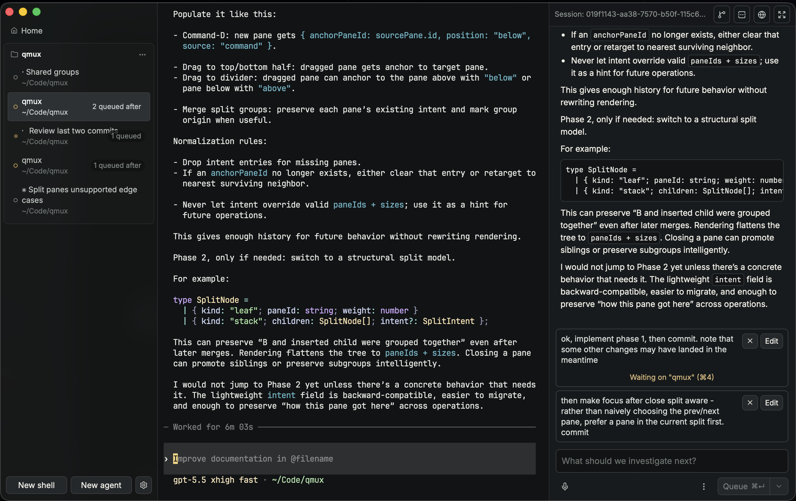

# qmux

qmux is a desktop terminal multiplexer for coding agents.

<p align="center"></p>

It has a native UI for launching agents, queueing follow-ups,
tracking agent status, and driving TUI-based agents.

Agents are integrated through a pluggable adapter layer. Claude Code,
Codex, OpenCode, Grok, Muse, [Pi](https://pi.dev), Cursor Agent, and Devin CLI
are included as adapters, each with
lifecycle hooks, native transcripts, and session resumes. All except Muse,
Cursor, and Devin also support forks; Muse's CLI has no fork command, Cursor
Agent has no native fork, and Devin's `/fork` is TUI-only. New agents
can be added by implementing the adapter trait in Rust and adding a
matching UI adapter on the frontend.

## Features

- Native Ghostty terminals: each pane hosts a Metal-rendered Ghostty
  surface on macOS, with a portable Rust PTY backend for tests and
  non-macOS platforms.
- Agent panes for Claude Code, Codex, OpenCode, Grok, Muse, Pi, Cursor Agent, and Devin CLI, launched from the app
  or by running `claude` / `codex` / `opencode` / `grok` / `agent` / `muse` / `pi` / `cursor-agent` / `devin` inside a shell
  pane.
- Transcript tailing and a native follow-up composer: send, queue,
  steer, edit/reorder queued turns, and approve/deny permission prompts where
  supported.
- qMux slash commands in the follow-up composer: `/fork <message>` branches the
  current session, while `/worktree <message>` branches it in a fresh worktree.
  Typing `/` opens an upward command typeahead.
- Session/transcript recovery. Respawns recoverable panes and agents on
  restart, along with drafts that you've typed in qmux.
- Persisted pane, group, agent, transcript, and queued-turn metadata with
  best-effort restart recovery.
- Session forking from inside a running agent session (`qmux fork`),
  supported by Claude Code, Codex, OpenCode, Grok, and Pi.
- Prompt library: prompts as Markdown files with global and
  per-project scopes, `{placeholder}` fill-in, and a `Cmd-K` command
  palette covering prompts, tab navigation, and pane actions.
- App settings: color themes, body font, terminal font and size,
  terminal theme (qmux default plus bundled Ghostty color schemes), mouse
  wheel sensitivity, and a macOS wake lock that keeps the machine awake
  while agents are running (skipped on battery below 10%).
- (Experimental) git worktree creation for launched agents, with configurable
  global, local `.qmux/`, or local `.claude/` storage, dirty-worktree checks,
  and a delete-or-keep prompt when closing worktree-backed panes.
- (Experimental) A tab-bound, resizable browser panel. Token-gated local files
  remain in a sandboxed preview (Markdown renders as styled HTML); normal URLs
  display the isolated browser tab controlled by the active agent.
- (Experimental spike) qmux appears in Codex's `agent.browsers.list()` through
  its current private in-app-browser socket and implements tab, Playwright,
  Computer Use, screenshot, and raw CDP operations through a dedicated
  `chrome-headless-shell` process. qmux finds a bundled installation, then a
  PATH installation in a directory your account cannot write to (writable PATH
  entries and the default per-user Playwright cache are skipped so an agent
  cannot plant a binary qmux would execute), then a `PLAYWRIGHT_BROWSERS_PATH`
  cache; `QMUX_CHROME_HEADLESS_SHELL_PATH` can override discovery outright.
  This does not use a browser extension or the user's normal browser profile.
- macOS-only at this time. Linux support is planned for the future.

## Install

Requires macOS 13 (Ventura) or later. The DMG is a universal binary and runs
natively on Apple Silicon and Intel Macs.

1. Download the latest `.dmg` from the
   [releases page](https://github.com/raykyri/qmux/releases).
2. Open it and drag **qmux** into **Applications**.
3. You'll want the agent CLIs you use on your `PATH`: `claude`, `codex`,
   `opencode`, `grok`, `muse`, `pi`, `cursor-agent`, and/or `devin`.

qmux does not install agents or copy their credentials. Install and authenticate
at least one provider, then open **Settings → Agents** to check the executable,
version, authentication state, and Research compatibility detected by qmux.

| Provider | Executable | Sign in | Research |
| --- | --- | --- | --- |
| Claude Code | `claude` | `claude auth login` | Yes (2.1.0+) |
| Codex | `codex` | `codex login` | Yes |
| OpenCode | `opencode` | `opencode auth login` | No |
| Grok | `grok` | `grok login` | Yes |
| Muse | `muse` | Follow the CLI's interactive setup | No |
| Pi | `pi` | Configure a provider in Pi | No (0.80.5+) |
| Cursor | `cursor-agent` | `cursor-agent login` | No |
| Devin | `devin` | `devin auth login` | No |

An inconclusive authentication probe is shown as unknown rather than treated
as logged out, because environment credentials and custom provider endpoints
cannot always be verified by a CLI status command. A missing executable or a
definitive Research version/authentication failure is blocked before qmux
creates the run.

If macOS reports the app is damaged or can't be opened, clear the download
quarantine flag and launch it again:

```
xattr -cr /Applications/qmux.app
```

qmux checks the releases page for updates on startup and offers to install
them in place.

## Quickstart

Prerequisites:

- macOS.
- Rust toolchain.
- Node.js and npm.
- The agent CLIs you want to use on `PATH`: `claude`, `codex`, `opencode`, `grok`,
  `muse`, `pi`, `cursor-agent`, and/or `devin`.

Install dependencies:

```
git submodule update --init
npm install
```

The submodule pins the native GhosttyKit wrapper used by terminal surfaces. Its
checksum-pinned prebuilt framework is downloaded and cached automatically by
SwiftPM on the first Rust/Tauri build; rebuilding Ghostty itself is not required.

Run the app in development:

```
npm run dev:tauri
```

Build the app:

```
npm run build

# Headless build without the Finder-styled DMG window:
CI=true npm run build
```

Ordinary builds do not notarize, even when Apple credentials are present in
`.env`. To run the complete release workflow—including tests, signing,
notarization, updater metadata, checksums, and a draft GitHub release—from a
clean, pushed `main` checkout:

```
npm run build:release
```

After testing the draft's DMG, publish it with the command printed by the
release script.

Development:

```
# Run the complete JavaScript, plugin, integration, and Rust test suite
npm test

# Check Rust formatting
cargo fmt --manifest-path src-tauri/Cargo.toml --check

# Check Rust compilation
cargo check --manifest-path src-tauri/Cargo.toml

# Run Rust tests:
cargo test --manifest-path src-tauri/Cargo.toml
```

### Publishing configuration

Transcript and research publishing uses a GitHub OAuth App with Device Flow
enabled and the `gist` scope. The OAuth client ID is public configuration; no
client secret is embedded in qmux.

```
QMUX_GITHUB_CLIENT_ID=<oauth-client-id> npm run dev:tauri
```

Release builds should set `QMUX_GITHUB_CLIENT_ID` at compile time. Published
links default to `https://qmux.app/p/<gist-id>`; set `QMUX_SHARE_BASE_URL` to
override that origin for a development or staging build. `QMUX_GITHUB_TOKEN`
is a non-UI development override for automated testing with an existing token.

The qmux.app server serves the existing landing page at `/` and publications at
`/p/<gist-id>`:

```
npm run build:site:server
HOST=127.0.0.1 PORT=8787 npm run start:site
```

`GITHUB_READER_TOKEN` is optional for the server. When set, it raises the GitHub
API rate limit for publication reads; it is never sent to clients.

Hosted Gist comments use the OAuth App's web flow. Configure its callback URL as
`https://qmux.app/auth/github/callback`, then provide the server-side client
secret and an independent cookie-encryption secret:

```
GITHUB_OAUTH_CLIENT_ID=<oauth-client-id>
GITHUB_OAUTH_CLIENT_SECRET=<oauth-client-secret>
QMUX_SESSION_SECRET=<at-least-32-random-characters>
QMUX_PUBLIC_ORIGIN=https://qmux.app
```

Viewer access tokens are kept in encrypted, HTTP-only session cookies and are
used only to create comments through GitHub's Gist comments API. The comment
body remains readable on GitHub and carries a hidden qmux publication/node
anchor so research-node discussions render in the correct place.

Published research trees also accept structured follow-up proposals. Signed-in
readers can propose a question and optional answer on a published result; the
proposal is stored as a Gist comment. The publication owner can refresh,
accept, or decline proposals from the matching research tree in qmux. Accepting
creates a local child research run, and the next publication sync includes that
result with contributor attribution in `publication.json`, `README.md`, and the
node Markdown file. Owner resolutions remain visible as Gist comments so the
hosted view can show proposal status without a separate collaboration database.

## Using the App

- `Cmd-T`: open a shell pane in code mode; outside code mode, open the agent
  launcher.
- `Cmd-N`: focus Home.
- `Cmd-Shift-R`: switch to Research.
- `Cmd-backtick`: toggle between Terminal and Research.
- `Cmd-=` / `Cmd-+`: increase terminal font size.
- `Cmd--`: decrease terminal font size.
- `Cmd-0`: reset terminal font size.
- `Cmd-1`..`Cmd-9` / `Ctrl-1`..`Ctrl-9`: focus the corresponding pane tab.
- Hold `Cmd`: show floating shortcut hints for Home and pane tabs in the `Cmd-1`..
  `Cmd-9` range.
- `Ctrl-Tab` / `Ctrl-Shift-Tab`: cycle through visible pane tabs across groups.
- `Cmd-Shift-[` / `Cmd-Shift-]`: cycle through Home and open tabs.
- In Research, `Cmd/Ctrl-[` / `Cmd/Ctrl-]` or `Alt-Left` / `Alt-Right`
  navigate response history. Mouse back/forward buttons and horizontal
  two-finger trackpad or mouse-wheel gestures do the same.
- In Research, `Cmd-D`: create a new document (`Cmd-T` starts a new query).
- In Research, `Cmd-J`: jump to the open document's follow-up composer.
- In Research, `Cmd-O`: open or close the research folder menu.
- `Cmd-Shift-T`: switch back to Terminal from Research; otherwise restore the
  most recently closed pane.
- `Cmd-Shift-H`: focus Home.
- `Cmd-Shift-E` / `Ctrl-Shift-E`: expand or restore the active transcript pane,
  or toggle the browser overlay on shell-only panes.
- `Escape`: close the browser overlay when it is open, including while the
  terminal or embedded page holds keyboard focus.
- `Cmd-D` / `Cmd-Shift-D`: split the active terminal downward (in Research,
  plain `Cmd-D` creates a new document instead).
- `Cmd-W`: close the active pane.
- `Ctrl-W`: close the active pane unless focus is in a terminal or text field.
- `Cmd-K`: open the command palette (tab navigation, pane actions, saved
  prompts) when focus is outside a terminal.
- Double-tap `Option` (default): open Quick Launch, a standalone
  Spotlight-style popup that dispatches a task to any tab with an agent —
  shell or agent tabs — with the same actions as the right-pane composer:
  Send, Send Now, and Queue with its queue-options dropdown (fork,
  fork-in-worktree, new-session, and queue-after-session targets). Targets
  are listed in a sidebar-style column (status dot, tab name, group) with a
  filter field to narrow them; `Ctrl-Tab` / `Ctrl-Shift-Tab` (or
  `Cmd-Shift-[` / `Cmd-Shift-]`) switch the target without leaving the
  draft, the compose pane shows the selected tab's last exchange (the tail
  of your last message and the agent's reply) with any queued turns
  beneath it, and the launcher reopens on the tab you last dispatched to.
  The popup works from any app, without raising the qmux window. Change the hotkey in Settings between double-tap
  Control/Option/Command and Control/Option/Command-Space (options used by
  the show/hide shortcut are disabled); it is also available from the
  `Cmd-K` palette.
- `Cmd-,` / `Ctrl-,`: open settings.
- In the launcher, enter a prompt, and press `Cmd-Enter` to launch by default
  (`Enter` launches when "Require Cmd-Enter to send" is off).

## How it Works (for agents)

- A pane is one qmux-owned PTY. On macOS its byte stream is rendered by a
  host-managed native Ghostty surface; tests and other platforms use the
  portable renderer path.
- Shell panes spawn `$SHELL`.
- Agent panes spawn the adapter's configured agent binary, either in the current
  repo/directory or in a qmux-created agent worktree. Shell functions can route
  `claude`, `codex`, `opencode`, `grok` (and Grok's `agent` alias), `muse`, `pi`, `cursor-agent`, and `devin` through qmux from shell panes, but the
  adapter binary still needs to be installed or configured.
- Each pane receives:
  - `QMUX_PANE_ID`
  - `QMUX_SOCK`
  - `QMUX_TOKEN`
  - `QMUX_WORKSPACE_ROOT`
- `QMUX_CLI` is also set when the app can resolve the qmux executable, for
  in-pane tooling.
- Local pane processes receive a qmux-owned, socket-namespaced `bin` directory
  at the front of `PATH`. Its `qmux` symlink targets the qmux app binary that
  spawned the pane, so agents and other descendants can call `qmux` without
  changing the user's shell configuration or installing a global executable.
- Agent panes also receive `QMUX_AGENT_ID`.
- Hooks call `qmux notify <event>` over the token-gated Unix socket; qmux routes
  the notification to the owning agent's adapter. The same socket, scoped to the
  caller's pane, serves other in-pane commands such as `qmux fork` and
  `qmux open <file|localhost-url>`.
- In a remote pane, `qmux open <file>` streams one browser-previewable regular
  file of at most 10 MiB into an owner-only local snapshot. Only that exact file
  is granted to the embedded browser; HTML dependencies and sibling files are
  not copied or resolved. Remote loopback URLs are not forwarded.
- `qmux send [options] <message>` sends a manual user notification. The default
  `auto` mode shows a stacked card at the top right while qmux is focused and a
  native macOS notification while it is in the background; unavailable native
  delivery falls back to a card. Calls made inside a qmux pane are associated
  with that pane, so clicking the card or native notification returns to it.
  Calls from other local shells are accepted through a same-user,
  notification-only socket path and carry no pane action. Use `qmux send --help`
  for title, tone, sound, timeout, stdin, and delivery overrides. This is separate
  from the internal `qmux notify <event>` hook protocol above.
- A loopback-only (`127.0.0.1`) HTTP server with per-pane random tokens backs
  browser-overlay file targets. It serves only the requesting pane's group,
  current directory, and agent worktree roots.
- Codex Browser-plugin discovery listens on a qmux-owned socket under
  `/tmp/codex-browser-use`. This is an undocumented compatibility adapter and
  may need to track changes in the bundled OpenAI Browser plugin. It defaults to
  the production Codex build flavor; developers can override that metadata with
  `QMUX_CODEX_APP_BUILD_FLAVOR`.
- Transcript tailing starts once an adapter binds a transcript path: Claude via
  `SessionStart`, Codex via an explicit `SessionStart` path or session-id lookup,
  OpenCode via qmux-managed JSONL, Pi via its observer extension and native
  tree-shaped session JSONL, and Cursor via `sessionStart`'s conversation id
  (synthesized under `~/.cursor/projects/<slug>/agent-transcripts/`).
- Persisted state is written under `<workspaceRoot>/.qmux/state.json`, with normalized
  thread graphs stored separately in `<workspaceRoot>/.qmux/threads/<thread-id>.json`.
  Older worktree-local thread graphs are copied into this global store on startup and
  retained in place as recovery copies.
- Recent terminal output is retained in owner-only per-pane journals under
  `<workspaceRoot>/.qmux/terminal/` and safely replayed before a recovered
  process's startup output.
- `qmux.config.json` keeps dev-build state in a fixed, shared `~/.qmux` dir.
  Only dev (debug) builds discover it in the process cwd; release builds always
  use the platform data dir (`~/Library/Application Support/qmux` on macOS) so
  the session doesn't depend on how the app is launched. Set `QMUX_CONFIG=<file>`
  to point any build at an explicit config:

```json
{
  "workspaceRoot": "~/.qmux/workspaces",
  "socketPath": "~/.qmux/run/qmux.sock",
  "adapters": {
    "claude": { "binary": "claude" },
    "codex": { "binary": "codex" },
    "opencode": { "binary": "opencode" },
    "grok": { "binary": "grok" },
    "muse": { "binary": "muse" },
    "pi": { "binary": "pi" },
    "cursor": { "binary": "cursor-agent" },
    "devin": { "binary": "devin" }
  }
}
```

`~/…` paths expand against `$HOME` and absolute paths are honored verbatim.
Relative paths (for `workspaceRoot`/`socketPath`) are resolved from the config
file's directory when that directory is under `$HOME`; otherwise they fall back to
the platform data/runtime locations. Each adapter's `binary` is optional and
defaults to the command name (`claude`, `codex`, `opencode`, `grok`, `muse`, `pi`, `cursor-agent`, `devin`), which is
looked up on `PATH`; an absolute path or a `~/…` path (expanded against `$HOME`) is
used as given. A top-level `claudeBinary` is still honored for backward
compatibility. If the config file is absent, qmux uses the platform data
directory for workspace state and the platform runtime directory, or a `run/`
subdirectory of the data directory, for the control socket.

### Pi

The native Pi adapter requires Pi 0.80.5 or newer and is local-only. It launches
Pi's text TUI directly, uses Pi's default model, and leaves authentication,
model/thinking changes, project trust, packages, and extension UI inside Pi.
There is intentionally no Pi model selector in the qmux launcher.

qmux adds one explicit observer-only extension alongside the user's normal Pi
extensions. It registers no tools, commands, shortcuts, flags, providers, input
transforms, permission gates, UI, or trust handlers. It reports session identity,
the active tree leaf, prompts, model/thinking changes, and settled boundaries;
Pi's JSONL remains the transcript source of truth. Forks and message-anchored
forks call the `SessionManager` exported by the installed Pi package so Pi owns
session migration, IDs, labels, parent re-chaining, and target-directory layout.
Development builds can point `QMUX_PI_EXTENSION_DIR` at another copy of the
bundled observer and SessionManager helper.

User-installed extensions and packages are not disabled, and their relative
order is unchanged. They can still transform prompts, change models/tools, navigate or replace the
session, delay lifecycle handlers, or append custom content. qmux guarantees
tracking for standard Pi lifecycle/session behavior, with graceful raw rendering
for unknown content. An extension that suppresses standard Pi behavior, exits the
process, never settles, or writes an incompatible session graph can still prevent
queue/status/fork parity; qmux does not arbitrate extension semantics.

Interactive `pi` commands typed in a qmux shell are supervised like launches from
the app. Package/configuration and metadata utilities (`install`, `remove`,
`update`, `list`, `config`, `--help`, `--version`, `--list-models`, and `--export`)
pass through unchanged and do not create an agent record. RPC, JSON, print, and
ephemeral no-session modes are outside the native adapter contract.

The fork bridge currently expects the standard Node package layout, with
`dist/index.js` beside the canonical `dist/cli.js` behind the `pi` command. A
custom shell shim or standalone compiled Pi binary can still launch and resume,
but fork creation will fail with an actionable module-location error; point
`adapters.pi.binary` at the package's `dist/cli.js` when it is available.

### Cursor

The native Cursor adapter launches Cursor Agent's interactive TUI (`cursor-agent`)
in a qmux pane. It is local-only: authentication, model changes, and shell
approvals stay inside Cursor's TUI. Grok's `agent` alias is wrapped by the
Grok adapter; Cursor is `cursor-agent`. qmux does not treat Cursor's
`-w`/`--worktree` as qmux worktrees.

qmux injects one observer-only plugin with `--plugin-dir` on supervised
launches. It does not mutate user or project `hooks.json`. cursor-agent runs
those hooks with a constructed environment that does not inherit `QMUX_*`, so
the plugin shim resolves the pane through a binding file (`qmux cursor-notify`)
rather than the env-gated notify used by Claude/Grok. The plugin reports
session identity, prompt submit, and tool/shell start. cursor-agent only
fires `stop` / `afterAgentResponse` for user or project `hooks.json`, not
`--plugin-dir` plugins, so qmux treats a successful `turn_ended` JSONL
record as the idle signal. There is no native fork command. Development
builds can point `QMUX_CURSOR_PLUGIN_DIR` at another copy of the bundled
`qmux-cursor-plugin`.

Interactive `cursor-agent` commands typed in a qmux shell are supervised like
launches from the app. Management and metadata utilities (`login`, `logout`,
`status`, `whoami`, `about`, `models`, `mcp`, `plugin`, `worker`, `update`,
`ls`, `create-chat`, `generate-rule`, `rule`, `sandbox`,
`install-shell-integration`, `uninstall-shell-integration`, `bedrock`, `help`,
and `--help` / `--version` / `--print` / `--list-models`) pass through unchanged
and do not create an agent record. `cursor-agent resume` and `--continue` are
supervised TUI resumes, not passthroughs.

The qmux launcher can pass an optional `--mode plan` or `--mode ask`, plus a
model when one is selected. It does not pass `--force` or `--yolo`.

### Devin

The native Devin adapter launches Devin CLI's interactive TUI (`devin`) in a
qmux pane. It is local-only. Authentication, model changes, cloud `/handoff`,
and Devin's TUI `/fork` stay inside Devin. There is no CLI fork flag, so qmux
does not offer session branching.

Interactive `devin` commands typed in a qmux shell are supervised like
launches from the app. Management and metadata utilities (`auth`, `mcp`,
`models`, `rules`, `skills`, `plugins`, `cloud`, `list`, `update`, `migrate`,
`sandbox`, `setup`, `uninstall`, `help`, and `--help` / `--version` /
`--print`) pass through unchanged and do not create an agent record.
`devin --resume` / `-c` are supervised TUI resumes. `--config` and `--export`
are reserved: qmux copies the user's Devin config, injects lifecycle hooks,
and passes `--config` itself; `--export` writes ATIF JSON under
`.qmux/devin/` for the sidebar timeline.

The qmux launcher can pass `--permission-mode` (`auto`, `accept-edits`,
`smart`, `dangerous`) and a model when one is selected.

### Remote groups

A terminal group can be bound to another machine. Its directory, Git worktrees,
shells, and supported agents all run there; the qmux UI and terminal renderer
stay local. Binding the machine to the group keeps an agent on the same host as
the code it edits.

Add machines in **Settings → Remotes**. qmux stores those UI-managed entries in
`<workspaceRoot>/.qmux/preferences.json`; they appear in the Terminal settings
menu immediately, without an app restart. The settings row can also test
non-interactive SSH, tmux, qmux-cli, and supported agent providers before a
group exists.

The SSH host field suggests concrete aliases from `~/.ssh/config`, including
aliases declared in common `Include` files. Wildcard and negated `Host`
patterns are omitted because they are matching rules rather than destinations.

Machines can still be declared under `remotes` in `qmux.config.json`:

```json
{
  "remotes": {
    "devbox": {
      "host": "user@devbox",
      "label": "Dev box",
      "multiplexer": "tmux",
      "qmuxCli": "qmux-cli",
      "workspaceRoot": "/srv/qmux/workspaces"
    }
  }
}
```

Config-file entries appear read-only in Settings. **Copy to my remotes** opens
an editable duplicate with a new id; saving it leaves the config declaration
untouched. The effective list merges both stores, with an explicit
`qmux.config.json` entry winning if the same id also exists in preferences.

`host` is passed to the system `ssh` client, so `~/.ssh/config` aliases,
ProxyJump, agents, and hardware-backed keys work normally. Everything else is
optional (`label` falls back to the id, `multiplexer` to `tmux`, and `qmuxCli`
to `qmux-cli`). `workspaceRoot` is where remote worktrees live; it defaults to
`~/.qmux/workspaces`, expanded against the remote account's home.

Before creating a remote group:

- Configure non-interactive SSH authentication. Launch preparation and health
  checks use `BatchMode=yes`, so password-only authentication is not supported.
- Install tmux 3.2 or newer on the remote host.
- `qmux-cli` on Linux x86_64/aarch64 remotes is installed automatically (Test
  connection and New remote group) into `~/.qmux/bin/qmux-cli` from a
  linux-musl binary bundled in shipping builds. A custom `qmuxCli` path is
  left alone. Other OS/arch hosts keep using `qmux-cli` on PATH. Matching the
  app version is recommended. Plain shell transport can run without it, but
  shell wrappers and agent lifecycle hooks cannot. Shipping builds need Zig
  (`brew install zig`) and `cargo install cargo-zigbuild`.
- Install and authenticate Claude Code and/or Codex on the remote host if those
  adapters will be used. The launcher probes the remote binaries and auth state;
  it never reuses the Mac's readiness result.

Remote Claude and Codex transcripts are mirrored locally over a separate,
read-only SSH stream. The transcript view backfills the current session and
follows complete records as the agent writes them. Persisted offsets resume
streaming after reconnects or app restarts; a transcript connection failure
shows a notice while the terminal remains usable. Managed Linux `qmux-cli`
installs are upgraded automatically when required remote capabilities are
missing. Custom CLI installations must support `--transcript-stream-version`
(currently `3`), `--remote-open-file-version` (currently `1`), and
`--workspace-observation-version` (currently `1`).
The stream transfers UTF-8 chunks of at most 128 KiB, allowing image-bearing
records larger than a transport frame to be reassembled locally. Historical
records loaded on connection or reconnect update the transcript without
changing live agent status or advancing queued prompts.

In Terminal mode, the sidebar menu lists each saved remote above **New group…**.
**New remote group** atomically creates a group plus its first shell in that
account's home directory. **New remote shell** opens an `ssh` session to that
host as a tab in the current group; if the group is already bound to the
machine, it is an ordinary remote shell. A failed SSH/tmux launch rolls the
group back instead of leaving an empty entry.

The group **snapshots** the saved remote it was created against rather than referencing
it, keeping the id only as provenance. Editing or deleting a remote
therefore never moves or disables a workspace whose worktrees already live on
the old machine. Readiness checks also use that snapshot.

Git creation/status/removal and repository probes run through SSH. Each pane's
actual process runs in a nonce-named session on a dedicated
`tmux -L qmux -f /dev/null` server; qmux only owns a disposable local SSH/PTTY
attachment. It never uses attach-or-create during recovery, so a missing remote
process is reported rather than silently replaced. Shell integration and
per-pane agent hook files are provisioned under an owner-only
`<remote workspaceRoot>/.qmux/support/<session>/` directory.

SSH keepalives turn half-open links into reconnects, a short-lived ControlMaster
reuses authentication across lifecycle calls, and batch operations have a wall
clock deadline. While detached, the terminal shows a reconnect overlay and
blocks input. The tmux process keeps running with a 50,000-line history; on
reattach qmux safely reconciles the missed portion before live output resumes.
Resizing during the outage is remembered and applied to the next attachment.
Closing a pane kills its exact tmux session and removes its support directory.
Restarting qmux reattaches to the persisted session rather than relaunching the
command.

Remote shells, Claude Code, and Codex are supported. Claude receives lifecycle
settings but not qmux's bundled local plugin/skills. Codex keeps the remote
user's normal `CODEX_HOME` (auth, config, and sessions) and receives process-local
hook overrides. The remote control socket is an owner-only Unix socket forwarded
through SSH; no TCP listener or bearer token is exposed on the network.

Current limitations:

- Remote Research/SDK runs are disabled. Remote transcript files are not yet
  streamed into the local transcript sidebar, so message-anchored forks are
  unavailable; session-head resume/fork and terminal lifecycle hooks still work.
- Codex completion state uses its Stop hook remotely because the authoritative
  transcript `task_complete` record is not streamed yet.
- `herdr` is listed but intentionally not driveable; only managed tmux is
  supported.
- qmux does not blindly reap unclaimed `qmux-*` sessions at startup: two live
  qmux instances may share a host, and a prefix-only sweep could destroy the
  other instance's work. After a crash, inspect with
  `tmux -L qmux -f /dev/null list-sessions` and remove only sessions you have
  identified as stale. Automatic cleanup needs an explicit ownership lease.

## License

MIT (C) 2026
